<div id="top" align="center">

[![License][license-shield]](LICENSE)
[![Python][python-shield]](https://www.python.org/)
[![PHP][php-shield]](https://www.php.net/)
[![Release][release-shield]](https://github.com/franckferman/p0wnyShellX/releases)
[![CI][ci-shield]](https://github.com/franckferman/p0wnyShellX/actions)


**Polymorphic PHP webshell generator for authorized red team operations.**  
*A unique shell on every run. No two deployments share the same signature.*

</div>

---

## What is p0wnyShellX

p0wnyShellX is a **polymorphic generator** for post-exploitation PHP webshells, forked and heavily extended from [p0wny-shell](https://github.com/flozz/p0wny-shell).

The original p0wny-shell and most derivatives ship a **static file** — every deployment is byte-for-byte identical, making YARA/AV/SIEM detection trivial. p0wnyShellX solves this: instead of a static webshell, you run a Python generator that produces a **unique PHP file every time**, with randomized function names, routing tokens, junk code, bcrypt-hashed credentials, CSS themes, and a configurable AJAX transport layer.

```mermaid
flowchart LR
    A["python3 p0wnyShellX.py\n-p &quot;MyPass!&quot; -o shell.php"]

    subgraph engine ["Polymorphic Engine"]
        B1["Random function names\nPHP + JS — 250+ pool"]
        B2["Random routing tokens\n?x4r9tz=k2m8jvn"]
        B3["Bcrypt hash — cost=12\nplaintext never stored"]
        B4["Junk functions\n20–80 decoys per run"]
        B5["CSS theme\n3 camouflage themes"]
        B6["Shuffled exec order\nnew chain per build"]
        B7["AJAX transport\nplain / mimic / rc4"]
    end

    C["shell.php\nunique signature — never the same"]

    A --> engine
    engine --> C

    style engine fill:#0d1117,stroke:#27ae60,color:#ccc
    style A fill:#111,stroke:#27ae60,color:#ccc
    style C fill:#111,stroke:#27ae60,color:#27ae60
```



---

## Feature comparison

| Feature | p0wny-shell | p0wnyShellX |
|---|---|---|
| Authentication | None | Login form + session |
| Password storage | — | bcrypt cost=12 (via `password_verify`) |
| Timing-safe auth | — | `hash_equals` on username + `password_verify` |
| Static signature | Yes — every deploy identical | **No** — every deploy unique |
| Function names | Fixed (`featureShell`, etc.) | Random from 250+ business name pool |
| JS variable names | Fixed | Random |
| HTML element IDs | Fixed | Random tokens |
| Routing endpoints | Fixed `?feature=shell` | Random tokens (e.g. `?x4r9tz=k2m8jvn`) |
| Junk code | None | 20–80 dynamically generated decoy functions |
| Exec fallback order | Fixed | Weighted shuffle per run + random method drop |
| CSS camouflage | Transparent webshell | Fake monitoring dashboard (3 themes) |
| Password in file | — | bcrypt hash only — plaintext never stored |
| Reproductible builds | Yes (static) | Via `--seed` flag |

---

## Compared to Weevely

[Weevely](https://github.com/epinna/weevely3) is the reference CLI webshell for red teamers. The two tools solve different problems — they can complement each other.

| Feature | Weevely | p0wnyShellX |
|---|---|---|
| Authentication | MD5(password) as XOR key | bcrypt cost=12 + `password_verify` |
| Polymorphism | Variable shuffling + random string chunks | Business names, routing tokens, junk functions, bcrypt salt, exec order |
| Communication | XOR+gzip+base64 in POST body, obfuscated header/footer | 3 modes: `plain` (cleartext), `mimic` (base64 + random param names), `rc4` (RC4 + per-build shuffled base64 alphabet) |
| Interface | Python CLI client | Browser terminal — no tooling on operator machine |
| Camouflage | Bare PHP snippet | Fake monitoring dashboard (3 themes) |
| Modules | 30+ (reverse shell, SQL, net scan, proxy…) | Shell, upload, download, tab-complete |
| Exec methods | 9 — `exec`, `shell_exec`, `system`, `passthru`, `popen`, `proc_open`, `pcntl_fork`, `python_eval`, `perl_system` — shuffled | 4–6 per build — `exec`, `shell_exec`, `system` always present; `passthru`, `popen`, `proc_open` randomly dropped (~30% each); weighted order (reliable methods tend first) |
| `disable_functions` bypass | Yes — mod_cgi + `.htaccess` (Apache only, requires `AllowOverride` + write access) | No — not planned as a priority; the technique requires Apache + mod_cgi + AllowOverride + web-writable directory, which are rarely all met in prod |
| Reverse shell | Yes | No (planned) |
| Log clearing | Yes | No (planned) |
| Port scan | Yes | No (planned) |
| SQL console | Yes | No |

**Use Weevely when**: you need CLI automation, module ecosystem (SQL, reverse shell, scan), or obfuscated HTTP transport matters more than visual camouflage.

**Use p0wnyShellX when**: browser access is your only option, per-deploy unique signatures are the priority, or themed camouflage helps the shell survive visual inspection.

---

## How the polymorphism works

### 1. Function name randomization

Every PHP and JS function is assigned a name drawn at random from a pool of 250+ plausible business names (`archiveReplicationLog`, `fetchComplianceStatus`, `validateSchemaCompatibility`…). A new mapping is generated on each run.

```
# Run 1                          # Run 2
function archiveReplicationLog   function validateSchemaCompatibility
function fetchComplianceStatus   function computePipelineThroughput
```

The pool names are intentionally generic — they are indistinguishable from functions found in any real monitoring dashboard, CMS plugin, or enterprise PHP app. Writing a YARA rule on `fetchClusterStatus` or `validateCertificateChain` would produce massive false positives on legitimate codebases, making such a rule unusable in production. The only detectable artifact is the pool itself inside `p0wnyShellX.py` — but the generator never touches the target. The deployed shell contains only 15–20 names drawn from that pool, with no recognizable pattern left.

On top of that, junk functions and randomized routing tokens add further noise: each build looks like a different application, not a variant of the same tool.

> **Design note — why no random numeric suffix (`fetchClusterStatus_4823`):** appending digits would make every name look machine-generated at a glance — no real PHP codebase does this. It would destroy the "legitimate app" camouflage and, worse, create its own YARA signature (`[a-zA-Z]+_\d+`). The pool size (275 names, ~20 drawn per build) already makes per-build combinations astronomically large; suffixes add risk, not safety.

### 2. Routing token randomization

The AJAX routing parameter `?feature=` and its values (`shell`, `hint`, `pwd`, `upload`) are replaced by random alphanumeric tokens generated at build time and injected coherently into both PHP and JS.

```
# Original (static, detectable)
POST /?feature=shell

# Generated (unique per run)
POST /?x4r9tz=k2m8jvn
POST /?x4r9tz=p3nq7as
```

### 3. Bcrypt password hashing

The generator calls PHP at build time to compute a `bcrypt cost=12` hash of the password. The hash is embedded in the generated file; the plaintext never appears. Because bcrypt salts are random, the hash differs on every run even for the same password.

```php
# What gets stored in the generated file:
define('PHSH_R7VX2', '$2y$12$oEYz4jk/0pa1K...');

# Auth check:
function validateClusterState(string $login, string $pass): bool {
    return hash_equals($login, AUSR_5KQP) && password_verify($pass, PHSH_R7VX2);
}
```

### 4. Exec fallback chain — weighted shuffle + random drop

The shell tries multiple PHP execution functions in sequence until one succeeds. Every build applies two independent layers of variance to this chain.

**Layer 1 — composition: which methods are present**

Methods are split into two tiers:

| Tier | Methods | Behaviour |
|---|---|---|
| Core | `exec`, `shell_exec`, `system` | Always included |
| Optional | `passthru`, `popen`, `proc_open` | Each has a 30% chance of being dropped independently |

The three optional draws are independent — like three separate coin flips. Probabilities:

| Methods in build | How | Probability |
|---|---|---|
| 6 | All 3 optional survive: `0.7 × 0.7 × 0.7` | ~34% |
| 5 | Exactly 1 dropped: `3 × (0.7 × 0.7 × 0.3)` | ~44% |
| 4 | Exactly 2 dropped: `3 × (0.7 × 0.3 × 0.3)` | ~19% |
| 4 | All 3 dropped (`0.3³ ≈ 3%`) → 1 re-added by force | ~3% |

Most builds (78%) will have 5 or 6 methods. The rare 4-method build is never fewer than 4 — the generator always re-adds one optional if all three were dropped.

**Layer 2 — order: in what sequence they appear**

The active methods are assembled in a weighted random order. Each method has an internal weight:

```
exec (5) > shell_exec (4) > system (3) > passthru = popen = proc_open (2)
```

At each position, a method is drawn proportionally to its remaining weight. This means `exec` and `shell_exec` appear first in most builds, but the order is never fixed — it is re-rolled every run.

The weight hierarchy reflects practical reliability per method:

| Method | Weight | Why |
|---|---|---|
| `exec` | 5 | Captures output via array reference — no buffering, no stream handling. Cleanest capture path, most widely available when exec functions are not fully disabled. |
| `shell_exec` | 4 | Returns output as a string directly. Equally clean, slightly lower weight than `exec` because it returns `null` on error with no distinction from empty output. |
| `system` | 3 | Writes directly to stdout — requires `ob_start`/`ob_get_contents`/`ob_end_clean` to capture. If any of those three buffering functions are also disabled, the method silently produces no output. |
| `passthru` | 2 | Same stdout issue as `system`, but designed for binary output. Marginally less common in default PHP installs. Same `ob_*` dependency. |
| `popen` | 2 | Returns a file handle — requires a `fread` loop and `pclose`. More moving parts; stream may return partial output if the handle closes early. |
| `proc_open` | 2 | Most capable (full pipe control, stderr separation), but also the most complex. Requires `$pipes` array, `stream_get_contents`, `proc_close`. Any step failing silently means no output. |

```
# Three example builds
Build A : exec → shell_exec → system → popen → proc_open        (5 methods)
Build B : shell_exec → exec → popen → system                    (4 methods)
Build C : exec → system → shell_exec → passthru → popen → proc_open  (6 methods)
```

**Why this matters for detection**

A YARA rule targeting exec methods needs to commit to a specific set: "file contains `passthru` AND `popen` AND `proc_open`". That rule misses any build where one or more of those was dropped. A looser rule ("contains at least one of…") matches half the PHP on the internet. Neither is operationally viable at scale.

### 5. Dynamic junk code

Between 20 and 80 decoy PHP functions are generated per run, drawn from 20 body templates × 250+ name combinations, with randomized return values, loop counts, and string literals. They are scattered around the functional core to increase noise ratio.

### 6. AJAX transport modes

Every AJAX request between the browser and the shell carries parameters (`cmd`, `cwd`, `filename`…). In `plain` mode these are sent as-is. The `--transport` flag replaces this with one of three per-build traffic profiles:

**`plain` (default)** — no encoding, parameters sent as cleartext POST fields.
```
POST /?x4r9tz=k2m8jvn
cmd=id&cwd=%2Fvar%2Fwww
```
Low anomaly score. Suitable for environments without deep packet inspection. Default for a reason: high-entropy bodies (see below) can be more suspicious than plain text on ML-based sensors.

**`mimic`** — parameter names replaced by names drawn at random from a real-world webapp pool (`query`, `payload`, `ctx`, `token`…), values base64-encoded.
```
POST /?x4r9tz=k2m8jvn
payload=aWQ%3D&ctx=L3Zhci93d3c%3D
```
Looks like a standard API call. Parameter names change every build — no two mimic shells share the same names.

**`rc4`** — RC4 stream cipher + per-build shuffled base64 alphabet. Both the 16-byte key and the alphabet are generated at build time and baked into both PHP and JS.
```
POST /?x4r9tz=k2m8jvn
nonce=Ht3kVz9q...
```
POST body is opaque to regex-based WAF inspection. Note: high-entropy bodies are a signal for ML-based sensors (Darktrace, Vectra) — use only when the network has WAF coverage but no behavioral analytics.

> The entropy trade-off is why `plain` is the default. On most targets, blending into normal traffic is safer than encrypting everything.

---

## Requirements

- **Python 3.8+**
- **PHP 8.x CLI** — used by the generator to compute the bcrypt hash at build time

```bash
# Verify
python3 --version
php --version
```

---

## Installation

```bash
git clone https://github.com/franckferman/p0wnyShellX
cd p0wnyShellX
```

No dependencies to install. `p0wnyShellX.py` uses only the Python standard library.

---

## Usage

```bash
python3 p0wnyShellX.py [OPTIONS]
```

### Options

| Flag | Short | Default | Description |
|---|---|---|---|
| `--password` | `-p` | `changeme666` | Login password |
| `--user` | `-u` | `sysadmin` | Login username |
| `--output` | `-o` | `shell.php` | Output file path |
| `--junk` | `-j` | random 20–80 | Number of junk functions (max 200) |
| `--theme` | `-t` | random | CSS theme: `infra-dark`, `corporate-blue`, `matrix` |
| `--seed` | `-s` | — | Fixed RNG seed for reproducible output |
| `--no-junk` | — | false | Disable junk function generation |
| `--transport` | — | `plain` | AJAX encoding: `plain` / `mimic` / `rc4` |

### Examples

```bash
# Minimal — password only
python3 p0wnyShellX.py -p "MyPass123!" -o shell.php

# Full control
python3 p0wnyShellX.py \
  -p "MyPass123!" \
  -u operator \
  -j 60 \
  -t matrix \
  -o /tmp/shell_$(date +%s).php

# Reproducible (same output across runs — for testing)
python3 p0wnyShellX.py -p "MyPass123!" --seed 42 -o shell.php

# Minimal output (no junk, fastest generation)
python3 p0wnyShellX.py -p "MyPass123!" --no-junk -o shell.php

# Corporate blue theme, custom username
python3 p0wnyShellX.py -p "MyPass123!" -u webmaster -t corporate-blue -o shell.php

# Mimic mode — random param names, standard base64, blends into normal web traffic
python3 p0wnyShellX.py -p "MyPass123!" --transport mimic -o shell.php

# RC4 mode — RC4 + shuffled base64 alphabet, unique per build, WAF-blind
python3 p0wnyShellX.py -p "MyPass123!" --transport rc4 -o shell.php
```

---

## Shell commands

Once deployed and authenticated, the shell supports:

| Command | Description |
|---|---|
| `<any command>` | Execute shell command, output displayed |
| `cd /path` | Change working directory (persisted across commands) |
| `download /path/to/file` | Download file to browser |
| `upload /remote/path` | Upload local file via browser dialog |
| `clear` | Clear terminal output |
| `Tab` | Autocomplete files and commands |
| `↑ / ↓` | Command history navigation |
| `Ctrl+L` | Clear screen |
| `Ctrl+C` | Cancel current input |
| `Ctrl+U` | Clear input line |

---

## CSS Themes

| Theme | Appearance | Use case |
|---|---|---|
| `infra-dark` | Green on dark — "Resource Monitor" | Generic Linux infra |
| `corporate-blue` | Blue on dark — "InfraOps Console" | Enterprise environment |
| `matrix` | Green on black — "SysCore Terminal" | High contrast / classic |

Omit `--theme` to let the generator pick one at random on each run.

---

---

## CI/CD

Every push to a version tag (`v*.*.*`) triggers a GitHub Actions workflow that:

1. Installs Python 3.11 and PHP 8.3
2. Generates an example shell with default credentials
3. Runs `php -l` syntax validation
4. Verifies absence of static signatures
5. Publishes a GitHub Release with `p0wnyShellX.py` and the example shell as assets

On every push/PR, the CI also runs a polymorphism validation suite:
- Generates 7 shells (all themes, junk levels, and transport modes)
- Checks PHP syntax on all
- Confirms no static signatures remain
- Confirms two consecutive runs produce different output
- Verifies mimic transport uses randomized param names
- Verifies rc4 transport injects `tEnc`/`tDec` and no plain param names

---

## Security notes

- The bcrypt hash in the generated file is irreversible without brute-force
- `hash_equals` on username prevents timing oracle attacks
- `password_verify` is constant-time for the password comparison
- Session uses `cookie_httponly`, `use_strict_mode`, `cookie_samesite: Lax`
- Wrong password triggers a random 400–700ms delay (anti-bruteforce)

---

## Interactive command builder

**[franckferman.github.io/p0wnyShellX](https://franckferman.github.io/p0wnyShellX/)** — browser-based tool to configure and copy `p0wnyShellX.py` commands. Preset tabs (quick, infra-dark, corporate, matrix, minimal) and a live custom builder with password/user/theme/transport/junk/output inputs.

---

## Legal disclaimer

This tool is intended for **authorized penetration testing, red team engagements, and security research only**. Use it only on systems you own or have explicit written permission to test. Unauthorized use against systems you do not own is illegal. The author assumes no liability for misuse.

---

## License

GNU Affero General Public License v3.0 — see [LICENSE](LICENSE).

---

<!-- SHIELDS -->
[license-shield]: https://img.shields.io/github/license/franckferman/p0wnyShellX.svg?style=for-the-badge
[python-shield]: https://img.shields.io/badge/Python-3.8+-3776AB?style=for-the-badge&logo=python&logoColor=white
[php-shield]: https://img.shields.io/badge/PHP-8.x-777BB4?style=for-the-badge&logo=php&logoColor=white
[release-shield]: https://img.shields.io/github/v/release/franckferman/p0wnyShellX?style=for-the-badge
[ci-shield]: https://img.shields.io/github/actions/workflow/status/franckferman/p0wnyShellX/ci.yml?style=for-the-badge&label=CI
